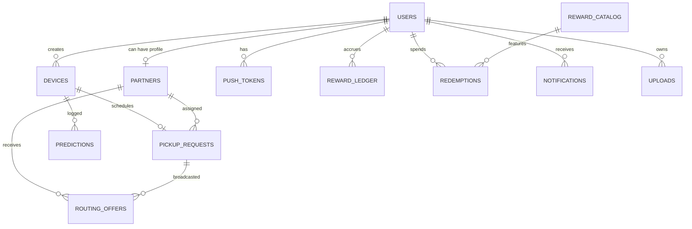
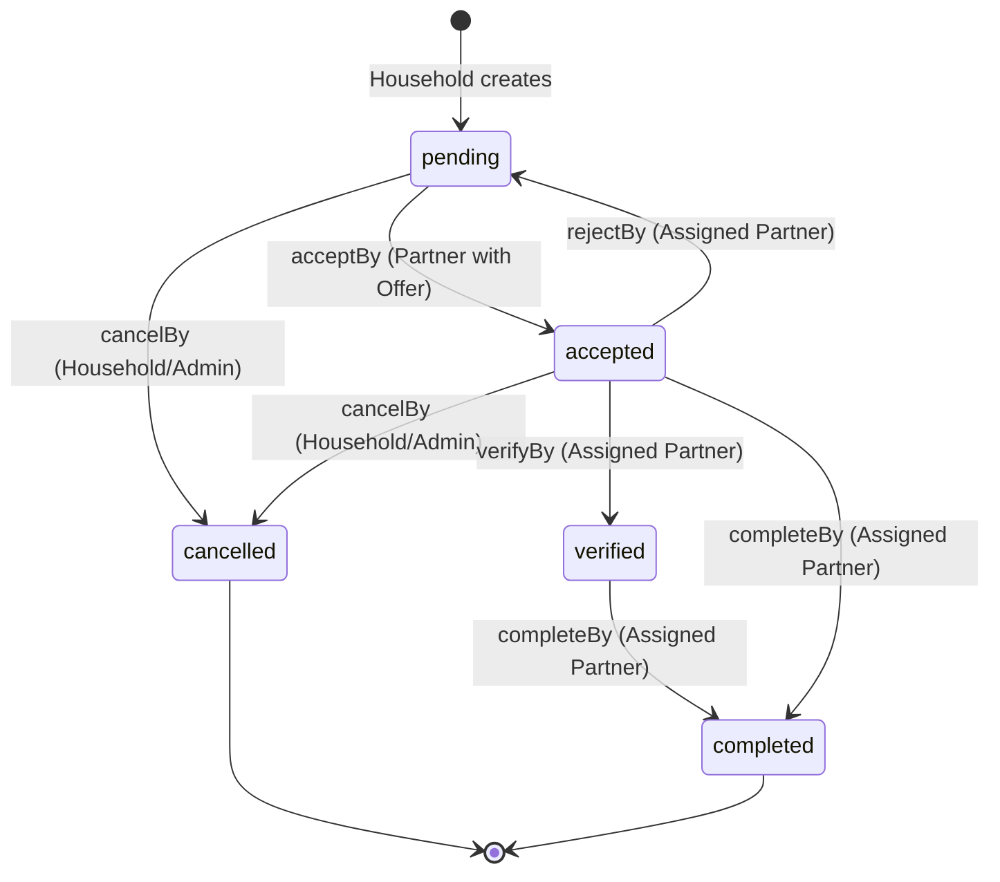
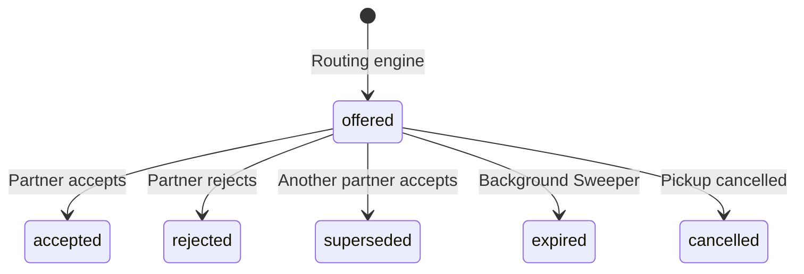
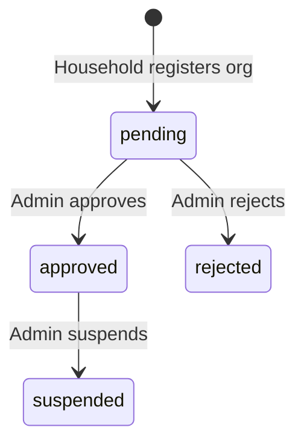
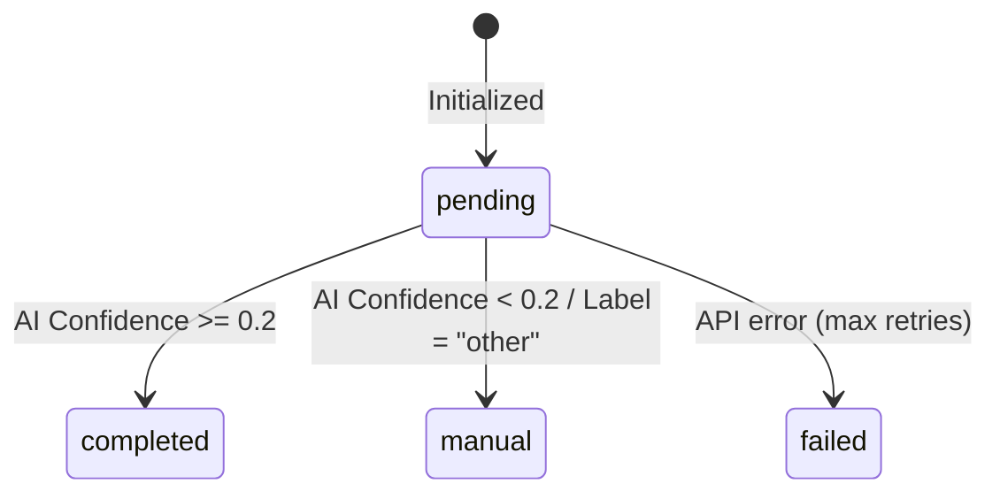
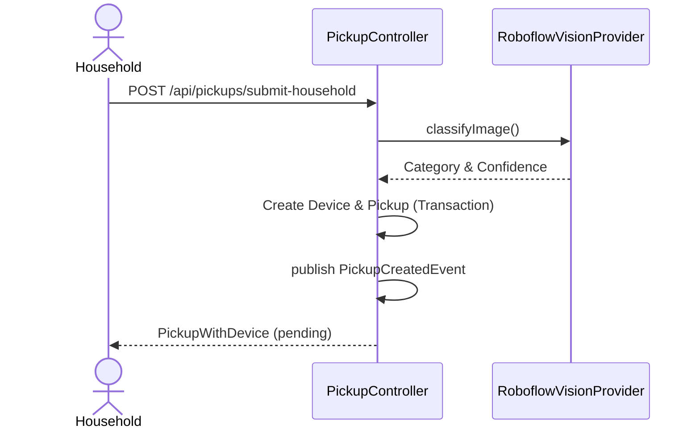

# EcoLoop Backend Architecture

## Table of Contents
1. [Overview](#1-overview)
2. [Architecture](#2-architecture)
3. [Tech Stack](#3-tech-stack)
4. [Prerequisites and Environment](#4-prerequisites-and-environment)
5. [Configuration and Profiles](#5-configuration-and-profiles)
6. [Setup and Run](#6-setup-and-run)
7. [Database](#7-database)
8. [Domain Model](#8-domain-model)
9. [State Machines](#9-state-machines)
10. [API Reference](#10-api-reference)
11. [Security](#11-security)
12. [Business Workflows](#12-business-workflows)
13. [Rewards](#13-rewards)
14. [Notifications and Audit](#14-notifications-and-audit)
15. [Logging and Observability](#15-logging-and-observability)
16. [File Storage](#16-file-storage)
17. [External Services and Integrations](#17-external-services-and-integrations)
18. [Scheduling and Background Jobs](#18-scheduling-and-background-jobs)
19. [Deployment and Operations](#19-deployment-and-operations)
20. [Testing](#20-testing)
21. [Frontend/Mobile](#21-frontendmobile)
22. [Findings and Risks](#22-findings-and-risks)
23. [Glossary and Open Questions](#23-glossary-and-open-questions)

---

## 1. Overview
EcoLoop is a backend platform connecting households disposing of e-waste with certified recycling partners. The core flow involves households submitting photos of e-waste, AI classifying the item, and a matchmaking engine dispatching offers to nearby eligible partners. 

### User Roles
- **HOUSEHOLD**: Standard user. Submits devices, schedules pickups, earns points, and redeems rewards.
- **PARTNER**: Recycling organizations. Uploads licensing, receives routing offers, accepts jobs, and verifies collections.
- **ADMIN**: Platform administrators. Approves/suspends partners, overrides pickups, reviews audit logs, and monitors system health.

### Core Flow
`Submit Device -> AI Classification -> Pickup Request Created -> Matchmaking (Offers Dispatched) -> Partner Accepts -> Partner Collects -> Household Earns Points`

### Repo Scope
This repository strictly contains the **backend REST API**.
*Frontend and Mobile code are **NOT FOUND** in this repository.*

### Repo Structure Tree
```text
/
├── src/main/java/com/ecoloop/
│   ├── audit/            # Audit logging, interceptor, Admin views
│   ├── classification/   # AI integration (Roboflow, Stubs)
│   ├── common/           # Security, Rate Limiter, Uploads, Web configs
│   ├── device/           # E-waste device management
│   ├── identity/         # Users, Auth, Sessions, Password resets
│   ├── notification/     # In-app notifications & preferences
│   ├── partner/          # Partner profiles & lifecycle
│   ├── pickup/           # Core pickup requests & transitions
│   ├── rewards/          # Ledger, Catalog, Redemptions
│   └── routing/          # Matchmaking, Scoring, Expirations
├── src/main/resources/
│   ├── application.yml   # Properties & profiles
│   ├── logback-spring.xml# Logging config
│   └── db/migration/     # Flyway SQL migrations
├── src/test/             # Integration and Unit tests
├── docker/               # PostgreSQL local scripts
├── pom.xml               # Maven dependencies
├── Dockerfile            # Container build
└── docker-compose.yml    # Local services orchestration
```

---

## 2. Architecture
The application follows a **Spring Modulith** architectural style, utilizing domain-driven packages (modules).

### Allowed Dependencies & Event Flow
Communication between disjoint domains should rely on **Spring Application Events**.
1. `PickupService` publishes `PickupCreatedEvent`, `PickupAcceptedEvent`, and `PickupCancelledEvent`.
2. `RoutingService` consumes these via `@EventListener` to generate or supersede matchmaking offers asynchronously, decoupling the matchmaking engine from the core transactional pickup lifecycle.

### Actual Cross-Module Coupling (Boundary Violations)
The codebase contains widespread Modulith boundary violations:
- `UploadController` directly injects `DeviceRepository`, `PartnerRepository`, and `PickupRepository` for authorization checks.
- `PickupService` directly injects `PartnerRepository` (from `partner`) and `DeviceRepository` (from `device`).
- `AdminAuditController` injects Repositories from `identity`, `partner`, and `pickup`.
- `RoutingService` injects `PickupRepository` and `DeviceRepository`.

---

## 3. Tech Stack
*Exact versions sourced from `pom.xml`.*
- **Language**: Java 21
- **Framework**: Spring Boot 3.3.13
- **Architecture**: Spring Modulith 1.2.7
- **Database**: PostgreSQL (Driver `org.postgresql:postgresql`)
- **Migrations**: Flyway Core & PostgreSQL integration
- **Session Store**: Spring Session Data Redis
- **API Docs**: Springdoc OpenAPI Starter WebMVC UI 2.6.0
- **Testing**: JUnit Jupiter, Spring Boot Test, Testcontainers (Postgres), H2 Database

---

## 4. Prerequisites and Environment
### Prerequisites
- JDK 21
- Maven 3.9+
- Docker & Docker Compose (for PostgreSQL and Redis)

### Environment Variables
| Variable | Default | Required | Purpose |
|----------|---------|----------|---------|
| `DATABASE_URL` | None | **Yes** | PostgreSQL JDBC URL |
| `DATABASE_USERNAME` | None | **Yes** | DB Username |
| `DATABASE_PASSWORD` | None | **Yes** | DB Password |
| `DB_POOL_MAX` | `15` | Optional | Hikari maximum pool size |
| `DB_POOL_MIN` | `5` | Optional | Hikari minimum idle connections |
| `REDIS_URL` | `redis://localhost:6379` | Optional | Redis connection for Spring Session |
| `SERVER_ADDRESS` | `0.0.0.0` | Optional | Tomcat bind address |
| `PORT` | `8090` | Optional | Tomcat port |
| `CORS_ORIGINS` | None | Optional | Allowed Origins for CORS |
| `COOKIE_SECURE` | `true` | Optional | Set to false for local HTTP dev |
| `COOKIE_SAME_SITE` | `none` | Optional | SameSite attribute for session cookies |
| `ECOLOOP_AI_PROVIDER` | `stub` | Optional | Use `roboflow` for real AI |
| `ROBOFLOW_API_KEY` | None | Req (if AI) | Roboflow authentication |
| `ROBOFLOW_MODEL_ID` | `e-waste-qmxtt-zuyip/1`| Optional | Roboflow specific model string |
| `ROBOFLOW_MAX_ATTEMPTS` | `2` | Optional | API retry limit |
| `ROBOFLOW_RETRY_BACKOFF_MS` | `200` | Optional | Delay between retries |
| `ROBOFLOW_CIRCUIT_FAILURE_THRESHOLD`| `5` | Optional | Consec failures to open circuit |
| `ROBOFLOW_CIRCUIT_COOLDOWN_MS` | `30000` | Optional | Circuit breaker cooldown |
| `ECOLOOP_MAX_CONCURRENT_CLASSIFICATIONS`| `1` | Optional | Semaphore limit for API calls |
| `ECOLOOP_OFFER_EXPIRATION_ENABLED` | `true` | Optional | Toggle routing sweeper job |
| `ECOLOOP_OFFER_EXPIRATION_INTERVAL_MS`| `3600000` | Optional | Sweeper frequency (1 hour) |
| `ECOLOOP_OFFER_EXPIRATION_BATCH_SIZE` | `500` | Optional | Paging size for sweeping |
| `ECOLOOP_RETENTION_ENABLED` | `true` | Optional | Toggle automated retention sweeper |
| `ECOLOOP_RETENTION_INTERVAL_MS` | `86400000` | Optional | Retention frequency (24 hours) |
| `ECOLOOP_RETENTION_AUDIT_DAYS` | `365` | Optional | Audit log retention window (days) |
| `ECOLOOP_RETENTION_TOKEN_DAYS` | `7` | Optional | Expired reset token retention (days) |

---

## 5. Configuration and Profiles
### Profiles
- **`prod` (Default)**: Uses PostgreSQL, Redis for sessions, expects full configuration.
- **`test` (`application-test.yml`)**: Disables Flyway, uses H2 in-memory DB (`jdbc:h2:mem:testdb`), disables Redis sessions (`store-type: none`), mocks AI (`stub`), disables routing expiration.

---

## 6. Setup and Run
### Docker Compose
Contains a single `app` service that builds from the local Dockerfile and binds to `8090`. Expects a `.env` file on the host. **(Corrected)**: The `docker-compose.yml` file does *not* contain definitions for `postgres` or `redis` services. It only contains the `app` service and a local volume `ecoloop-uploads:/app/uploads`. The user must run PostgreSQL and Redis separately.

### How to Run Tests
`mvn test`. Testcontainers handles PostgreSQL automatically for integration tests (via `PostgreSqlIntegrationTest.java`).

### How to Seed Data
`V3__seed_reward_catalog.sql` automatically runs via Flyway to seed the rewards. No other seed mechanisms are provided in the repository.

---

## 7. Database

### Tables and Constraints
All tables use `UUID` for primary keys.

| Table | Purpose | Notable Columns & Constraints |
|-------|---------|-------------------------------|
| `users` | Identity and roles | `lower(email)` UNIQUE, `password_hash`, `role` CHK `IN ('HOUSEHOLD', 'PARTNER', 'ADMIN')` |
| `push_tokens` | Device notification tokens | `user_id`, `token` (Composite PK) |
| `devices` | Submitted e-waste | `ai_status` CHK `IN ('pending', 'completed', 'failed', 'manual')` |
| `predictions` | Audit log of AI responses | `request_id`, `raw_response`, `latency_ms` |
| `partners` | Organization profiles | `status` CHK `IN ('pending', 'approved', 'rejected', 'suspended')`, `license_upload_id` |
| `pickup_requests` | Logistics jobs | `status` CHK `IN ('pending', 'accepted', 'verified', 'completed', 'cancelled')`, UNIQUE `(device_id)` active lock. |
| `routing_offers` | Matchmaking propositions | `status` CHK `IN ('offered', 'accepted', 'rejected', 'superseded', 'cancelled', 'expired')`, UNIQUE `(pickup_id, partner_id)` |
| `reward_catalog` | Redeemable items | `points_cost`, `is_active` |
| `reward_ledger` | Append-only points balance | `points`, `type` CHK `IN ('earn', 'redeem', 'bonus', 'adjustment', 'pickup_completion')`, UNIQUE `(user_id, reference_id)` |
| `redemptions` | Log of spent points | `catalog_item_id`, `points_cost` |
| `notifications` | In-app inbox | `is_read`, `type`, `reference_id` |
| `audit_logs` | Security/Action logs | `actor_id`, `action`, `details` (JSONB) |
| `notification_preferences` | User comms toggles | `pickup_updates`, `points_updates`, `offer_alerts` |
| `uploads` | File metadata | `sha256_checksum`, `file_size`, `content_type` |
| `upload_contents` | Binary file storage | `content` (BYTEA) |
| `password_reset_tokens`| Recovery links | `selector` (UNIQUE), `token_hash` (UNIQUE) |

### ER Diagram


### Migrations
- **V1**: Base schema.
- **V2**: Adds `notification_preferences`.
- **V3**: Seeds `reward_catalog`.
- **V4**: Hardens workflow logic. Adds `uploads`, `password_reset_tokens`. Adds strict `CHECK` constraints on status enums. Adds `UNIQUE` constraints to enforce workflow limits.
- **V5**: Secures password reset tokens (adds `selector`). Modifies `devices.image_url` logic.
- **V6**: Shifts file storage into the database (`upload_contents` BYTEA table).
- **V7**: Email verification support (`users.email_verified`, `email_verification_tokens`).
- **V8**: Routing completeness support (`routing_offers.round` column and `(pickup_id, round)` index).
- **V9**: Pagination and query performance indexes (`notifications(user_id, created_at DESC)`, `notifications(user_id, is_read)`, `audit_logs(created_at DESC)`, `reward_ledger(user_id, created_at DESC)`).
- **V10**: Database hygiene:
  - **Preconditions & Cleanups**: Abort threshold of 10,000 rows. Nullifies orphaned `audit_logs.actor_id` entries with rows affected logged via `RAISE WARNING`. Removes duplicate push tokens across users retaining the newest registration (`created_at DESC`, tie-break lowest `user_id`). Verifies user phone uniqueness fail-fast before index creation.
  - **Supporting Query Indexes**: `idx_routing_offers_status_expires_at` on `routing_offers (status, expires_at)`, `idx_pickup_requests_partner_status` on `pickup_requests (partner_id, status)`, `idx_password_reset_tokens_expires_at` on `password_reset_tokens (expires_at)`, and partial index `idx_password_reset_tokens_used_at` on `password_reset_tokens (used_at) WHERE used_at IS NOT NULL`.
  - **Soft Deletion**: Adds `users.deleted_at TIMESTAMPTZ NULL`.
  - **Partial Unique Indexes**: `uq_users_phone` on `users (phone) WHERE phone IS NOT NULL` (permits multiple null phone values) and `uq_push_tokens_token` on `push_tokens (token)`.
  - **Foreign Key ON DELETE Policies**: Wrapped in `DO $$ BEGIN IF NOT EXISTS (SELECT 1 FROM pg_constraint WHERE conname = '...') THEN ... END IF; END $$;` blocks:
    - `fk_audit_logs_actor` on `audit_logs (actor_id) REFERENCES users(id) ON DELETE SET NULL`
    - `fk_uploads_user` on `uploads (user_id) REFERENCES users(id) ON DELETE CASCADE`
    - `fk_upload_contents_upload` on `upload_contents (upload_id) REFERENCES uploads(id) ON DELETE CASCADE`
    - `fk_reward_ledger_user` on `reward_ledger (user_id) REFERENCES users(id) ON DELETE RESTRICT`
    - `fk_redemptions_user` on `redemptions (user_id) REFERENCES users(id) ON DELETE RESTRICT`
    - `fk_pickup_requests_user` on `pickup_requests (user_id) REFERENCES users(id) ON DELETE RESTRICT`

### Rollback Procedure (V10)
To revert V10 database hygiene changes:
```sql
ALTER TABLE audit_logs DROP CONSTRAINT IF EXISTS fk_audit_logs_actor;
ALTER TABLE uploads DROP CONSTRAINT IF EXISTS fk_uploads_user;
ALTER TABLE upload_contents DROP CONSTRAINT IF EXISTS fk_upload_contents_upload;
ALTER TABLE reward_ledger DROP CONSTRAINT IF EXISTS fk_reward_ledger_user;
ALTER TABLE redemptions DROP CONSTRAINT IF EXISTS fk_redemptions_user;
ALTER TABLE pickup_requests DROP CONSTRAINT IF EXISTS fk_pickup_requests_user;

DROP INDEX IF EXISTS uq_users_phone;
DROP INDEX IF EXISTS uq_push_tokens_token;
DROP INDEX IF EXISTS idx_password_reset_tokens_used_at;
DROP INDEX IF EXISTS idx_password_reset_tokens_expires_at;
DROP INDEX IF EXISTS idx_pickup_requests_partner_status;
DROP INDEX IF EXISTS idx_routing_offers_status_expires_at;

ALTER TABLE users DROP COLUMN IF EXISTS deleted_at;
```
> [!WARNING]
> Precondition-deleted duplicate push tokens, nullified orphaned audit log actors, and GDPR-anonymized user PII (`deleted_<uuid>@anonymized.invalid`, cleared phones) cannot be recovered by reverting DDL migrations.

---

## 8. Domain Model

### Entities & Meanings
- **`@Entity User`**: Fields: `id`, `email`, `phone`, `passwordHash`, `role`, `name`, `address`, `isActive`, `emailVerified`, `deletedAt`, `createdAt`, `updatedAt`. Supports soft deletion via `softDelete()`, setting `deletedAt` and deactivating account while preserving data integrity. `@JsonIgnore` is applied to `isDeleted()` and `getDeletedAt()`.
- **`@Entity Partner`**: Fields: `id`, `userId`, `orgName`, `type`, `status`, `licenseNo`, `licenseUploadId`, `serviceAreas`, `capabilities`, `capacity`, `rating`, `createdAt`, `updatedAt`.
- **`@Entity Device`**: Fields: `id`, `userId`, `category`, `condition`, `imageUrl`, `aiCategory`, `aiConfidence`, `aiStatus`, `aiProvider`, `createdAt`, `updatedAt`.
- **`@Entity PickupRequest`**: Fields: `id`, `userId`, `deviceId`, `partnerId`, `status`, `address`, `scheduledAt`, `completedAt`, `createdAt`, `updatedAt`, `verifiedCategory`, `verifiedCondition`, `verificationNotes`, `verificationEvidenceUrl`, `verifiedAt`, `verifiedBy`.
- **`@Entity RoutingOffer`**: Fields: `id`, `pickupId`, `partnerId`, `status`, `expiresAt`, `createdAt`, `score`, `rejectionReason`.
- **`@Entity RewardLedger`**: Fields: `id`, `userId`, `points`, `type`, `description`, `referenceId`, `createdAt`.
- **`@Entity RewardCatalogItem`**: Fields: `id`, `name`, `description`, `pointsCost`, `imageUrl`, `isActive`, `createdAt`.
- **`@Entity Redemption`**: Fields: `id`, `userId`, `catalogItemId`, `pointsCost`, `status`, `createdAt`.
- **`@Entity Notification`**: Fields: `id`, `userId` (scalar UUID, no entity FK), `title`, `body`, `isRead`, `type` (`NotificationType` enum mapped via `NotificationTypeConverter`), `referenceId`, `createdAt`.
  - **Canonical `NotificationType` Enum**: `offer_received`, `offer_superseded`, `pickup_accepted`, `pickup_reoffered`, `pickup_cancelled`, `pickup_verified`, `pickup_completed`, `pickup_reassigned`, `pickup_routing_escalated`, `pickup_routing_delayed`, `partner_approved`, `partner_suspended`, `partner_changed`.
  - **Database Constraints**: Protected by Flyway V11 partial unique index `uq_notifications_user_type_ref` (`WHERE reference_id IS NOT NULL`) for idempotency and Flyway V12 `CHECK` constraint `ck_notifications_type`.
- **`@Entity AuditLog`**: Fields: `id`, `actorId`, `actorRole`, `action`, `entityType`, `entityId`, `result`, `details` (Map/JSON), `createdAt`.
- **`@Entity UploadMetadata`**: Fields: `id`, `userId`, `purpose`, `storagePath`, `originalFilename`, `contentType`, `fileSize`, `sha256Checksum`, `createdAt`.
- **`@Entity UploadContent`**: Fields: `uploadId`, `content` (byte[]).
- **`@Entity PasswordResetToken`**: Fields: `id`, `userId`, `selector`, `tokenHash`, `expiresAt`, `usedAt`, `createdAt`.

### Soft Deletion & GDPR Policy (Phase 2C)
- **GDPR Policy**: *"Never hard-delete users; soft-delete anonymizes email/phone/name/address and leaves ledger intact."*
  - **Service-Coordinated Execution**: `UserService.softDeleteUser(UUID userId)` annotated with `@Transactional` coordinates account termination:
    1. Null-ID / Transient Guard: Throws `IllegalArgumentException` on null ID, and entity `User.softDelete()` verifies `this.id != null` (throwing `IllegalStateException` on transient entities).
    2. Session Revocation: Immediately invokes `SessionRevocationService.revokeAllUserSessions(user.getEmail())`.
    3. Token Cleanup: Purges `push_tokens` (`pushTokenRepository.deleteAllByUserId(userId)`) and `password_reset_tokens` (`passwordResetTokenRepository.deleteAllByUserId(userId)`).
    4. Entity PII Anonymization: Sets `deletedAt = Instant.now()`, `active = false`, `name = "Anonymized User"`, `phone = null`, `address = null`. Overwrites email with RFC 2606 domain: `"deleted_" + id + "@anonymized.invalid"`. Sets password hash to non-bcrypt sentinel `"ANONYMIZED_USER_SENTINEL_NON_AUTHENTICATABLE"`.
    5. Partner Profile Anonymization: If the user was an organization partner, anonymizes `orgName = "Anonymized Partner"`, `serviceAreas = null`, `capabilities = null`, `licenseNo = null`, `licenseUploadId = null`, and sets `status = "suspended"`.
  - **Active vs. Deleted Semantics**: `User.isActive()` is derived strictly as `active && deletedAt == null`. Attempting to reactivate a soft-deleted user via `AdminUserController.activate(id)` is explicitly rejected with `409 CONFLICT` ("Cannot reactivate a soft-deleted user").
  - **Ledger Preservation**: `reward_ledger` records remain completely intact and linked to `userId` to ensure non-repudiation and financial ledger auditability.
  - **Re-Registration Policy**: Because the email is replaced with an anonymized pattern (`@anonymized.invalid`) and phone is nulled, the user's former email and phone are immediately released. A user can freely re-register a new account using the previous credentials without unique constraint collisions.
  - **Query Filter Policy**: At the JPA entity level, `User` remains unfiltered (no global `@SQLRestriction` / `@Where`) to allow historical relations (such as audit logs, redemptions, and past pickup completions) to load without entity-not-found exceptions. All user-facing queries explicitly filter `deletedAt IS NULL`:
    - Admin user listing: `UserSpecifications.notDeleted()` (`cb.isNull(root.get("deletedAt"))`).
    - User authentication / login: `AuthController#login` and `IdentityService#loadUserByUsername` reject soft-deleted users.
    - Partner active jobs & monthly completions: `PickupRepository#countActiveJobsByPartnerId`, `countActiveJobsByPartnerIds`, and `PartnerController#kpis` exclude jobs from soft-deleted users; soft-deleted partners are denied KPI access.

### Response DTOs and Projection Allowlists (Phase 2B)
To prevent JPA entity leakage, sensitive field exposure, and circular references, all public-facing endpoints return immutable record DTOs:
- **`DeviceDto`**: `(id, userId, category, condition, imageUrl, aiCategory, aiConfidence, aiStatus, aiProvider, createdAt, updatedAt)`.
- **`NotificationDto`**: `(id, userId, title, body, isRead, type, referenceId, createdAt)`.
- **`RoutingOfferDto`**: `(id, pickupId, status, expiresAt, round, rejectionReason, createdAt)`. Strict allowlist: explicitly omits internal routing algorithm weights/scores (`score`) and `partnerId` to prevent competitive intelligence leaking to competing partners.
- **`PartnerPublicDto`**: `(id, orgName, type, serviceAreas, capabilities, rating)`. Strict public allowlist returned to non-admin/non-owner callers: omits internal compliance and profile metadata (`userId`, `licenseNo`, `licenseUploadId`, `capacity`, `createdAt`, `updatedAt`, `status`). Full `PartnerDto` is restricted to profile owners and administrators.
- **`RewardLedgerDto`**: `(id, userId, points, type, description, referenceId, createdAt)`.
- **`RewardCatalogItemDto`**: `(id, name, description, pointsCost, imageUrl, isActive, createdAt)`.
- **`RewardRedemptionDto`**: `(id, userId, catalogItemId, pointsCost, status, createdAt)`.
- **`AuditLogDto`**: `(id, actorId, actorRole, action, entityType, entityId, result, details, createdAt)`. The `details` field is projected as a Jackson `JsonNode` (parsed defensively with fallback to empty object if unparseable).
- **Instant Serialization**: All `Instant` timestamp fields serialize to standard ISO-8601 strings with trailing `Z` (e.g. `2026-10-07T17:30:00Z`) via Jackson `JavaTimeModule` with `WRITE_DATES_AS_TIMESTAMPS = false`.

### Hardcoded Constants
- **`25` Points**: Awarded automatically inside `PickupService.completeAcceptedPickup`. Not configurable via properties.
- **`5MB` (5 * 1024 * 1024)**: Max upload limit in `FileStorageService.MAX_FILE_SIZE`. Not configurable.
- **`15` Minutes**: Password reset token TTL (`PasswordResetService.TOKEN_EXPIRY`). Not configurable.
- **`24` Hours**: Routing offer TTL. Defined internally in `RoutingService.java#createTopNOffers` as `Instant.now().plusSeconds(24 * 3600)`. Not configurable.
- **Top `5`**: Max partners offered a routing job. Defined internally in `RoutingService.java#createTopNOffers` as `.limit(5)`. Not configurable.
- **`0.2` Floor**: AI confidence threshold below which predictions force a `manual` status (`RoboflowVisionProvider.CONFIDENCE_FLOOR`). Not configurable.

---

## 9. State Machines

### Pickups (`pickup_requests`)
| From | To | Method | Endpoint | Actor/Role | Preconditions | Side Effects |
|------|----|--------|----------|------------|---------------|--------------|
| `*` | `pending` | `createPickup(ActorContext, CreatePickup)` | `POST /api/pickups` | HOUSEHOLD, ADMIN | Device owned | `PickupCreatedEvent` |
| `pending`, `accepted` | `cancelled` | `cancelOwnedPickup(ActorContext, UUID)` | `POST /{id}/cancel` | HOUSEHOLD, ADMIN | Ownership | `PickupCancelledEvent` |
| `pending` | `accepted` | `acceptOfferedPickup(ActorContext, UUID, UUID)` | `POST /{id}/accept` | PARTNER | Valid active offer for pickup, Under capacity, Approved | Offer accepted, `PickupAcceptedEvent` |
| `accepted` | `pending` | `rejectAssignedPickup(ActorContext, UUID, String)` | `POST /{id}/reject` | PARTNER | Assignment | `PickupCreatedEvent` (re-published) |
| `accepted` | `verified` | `verifyAssignedPickup(ActorContext, UUID, VerifyRequest)` | `POST /{id}/verify` | PARTNER | Assignment | None |
| `accepted`, `verified` | `completed` | `completeAssignedPickup(ActorContext, UUID)` | `POST /{id}/complete` | PARTNER | Assignment | Earn 25 points, Audit |

*The unused `in_progress` state was removed in Flyway V13. Legacy rows are normalized to `accepted`; transitions can still skip `verified` and go directly from `accepted` to `completed`.*

### Aggregate Root Encapsulation (Phase 1C)
- **`PickupRequest extends AbstractAggregateRoot<PickupRequest>`**: State transitions and role validations are encapsulated directly within the `PickupRequest` domain aggregate root:
  - `acceptBy(ActorContext, RoutingOffer)`: Enforces role `PARTNER`, status `pending`, offer ownership & pickup match. Sets status to `accepted`, partner ID, and registers `PickupAcceptedEvent`.
  - `cancelBy(ActorContext)`: Enforces role `HOUSEHOLD` (with ownership check) or `ADMIN`. Enforces unified cancellation allowlist `{pending, accepted}`. Sets status to `cancelled` and registers `PickupCancelledEvent`.
  - `rejectBy(ActorContext, String reason)`: Enforces role `PARTNER`, assignment match, and status `accepted`. Clears partner ID to `null`, reverts status to `pending`, and registers `PickupCreatedEvent` for routing re-dispatch.
  - `verifyBy(ActorContext, VerifyRequest)`: Enforces role `PARTNER`, assignment match, and status `accepted`. Sets verification attributes and registers `PickupVerifiedEvent`.
  - `completeBy(ActorContext)`: Enforces role `PARTNER`, assignment match, and status `{accepted, verified}` (idempotent if already `completed`). Sets completed timestamp and registers `PickupCompletedEvent`.
  - `reassignBy(ActorContext, UUID newPartnerId)`: Enforces role `ADMIN`, requires non-null target, rejects terminal states `{completed, cancelled}`. Sets new partner ID and registers `PickupReassignedEvent`.
- **Cancellation Allowlist Unification**: Both `/api/pickups/{id}/cancel` and `/api/devices/{id}/cancel-pickup` delegate directly to `pickup.cancelBy(actor)`, strictly enforcing the allowlist `{pending, accepted}` (rejecting attempts to cancel `verified` or `completed` pickups with `409 CONFLICT`).


### Phase 1F — Comprehensive Regression Testing & Definition of Done Sign-Off
- **`AuthorizationMatrixTest`**: Full parameterized matrix test across `(Role, Action, StartStatus)` validating all 43 permutations of §7/§9 state table. Explicit cases:
  - `PARTNER` accepts pending WITHOUT offer -> 403 Forbidden.
  - `PARTNER` accepts pending WITH expired offer -> 409 Conflict.
  - `PARTNER` accepts pending WITH another partner's offer -> 403 Forbidden.
  - `HOUSEHOLD` calls complete via any endpoint (`/api/pickups/{id}/complete`, `/api/routing/offers/{id}/complete`, `/api/partners/jobs/{id}/complete`) -> 403 Forbidden.
  - `HOUSEHOLD` cancels verified via `/api/pickups/{id}/cancel` -> 409 Conflict.
  - `HOUSEHOLD` cancels verified via `/api/devices/{id}/cancel-pickup` -> 409 Conflict.
  - `ADMIN` reassigns to unapproved partner -> 409 Conflict.
  - `ADMIN` reassigns to at-capacity partner -> 409 Conflict.
- **`PickupServiceTest`**: Validates `completeAssignedPickup` credits exactly 25 points to household, writes one `reward_ledger` row, and is idempotent on retry.
- **`ApplicationModulesVerifyTest`**: Surfaces Modulith boundary violations documented in §2/§19 (§22 finding).
- **Phase 1 Definition of Done (All 5 Criteria Verified)**:
  1. No service method can accept a pickup without an `offerId`.
  2. No household code path can trigger pickup completion.
  3. Both household cancel endpoints enforce the identical allowlist `{pending, accepted}`.
  4. Admin reassign validates status, capacity, and emits events.
  5. Security and state matrix tests fail the build on any regression.


### Routing Offers (`routing_offers`)
| From | To | Method | Endpoint | Actor/Role | Preconditions | Side Effects |
|------|----|--------|----------|------------|---------------|--------------|
| `*` | `offered` | `createTopNOffers` | Background | SYSTEM | Top 5 scored | None |
| `offered` | `accepted` | `acceptOffer` | `POST /offers/{id}/accept` | PARTNER | Not expired | Delegates to Pickup |
| `offered`, `accepted` | `rejected` | `rejectOffer` | `POST /offers/{id}/reject`| PARTNER | Ownership | Delegates to Pickup |
| `offered` | `superseded` | `onPickupAccepted`| Background | SYSTEM | Event Listener| None |
| `offered` | `expired` | `sweep` | `@Scheduled` | SYSTEM | Expired TTL | None |



### Partners (`partners`)
| From | To | Method | Endpoint | Actor/Role | Preconditions | Side Effects |
|------|----|--------|----------|------------|---------------|--------------|
| `*` | `pending` | `register` | `POST /api/partners` | HOUSEHOLD | No profile | None |
| `pending` | `approved` | `approve` | `POST /{id}/approve` | ADMIN | Valid | Revokes sessions, sets `User.role = PARTNER` |
| `pending` | `rejected` | `reject` | `POST /{id}/reject` | ADMIN | Valid | Revokes sessions, sets `User.role = HOUSEHOLD`|
| `approved` | `suspended` | `suspend` | `POST /{id}/suspend` | ADMIN | Valid | Revokes sessions, sets `User.role = HOUSEHOLD`|



### Devices (`ai_status`)
| From | To | Method | Trigger | Side Effects |
|------|----|--------|---------|--------------|
| `*` | `pending` | Default | Creation | |
| `pending` | `completed`| `deviceAiStatus()` | Confidence >= 0.2 | |
| `pending` | `manual` | `deviceAiStatus()` | Confidence < 0.2 | |
| `pending` | `failed` | `deviceAiStatus()` | Catch block | |



---

## 10. API Reference

**Total Endpoints**: 37

| Controller (Count) | Method | Path | Auth/Role | Request DTO | Response Type | CSRF Ex? |
|---|---|---|---|---|---|---|
| **AuthController** (9) | `POST` | `/api/auth/register` | PermitAll | `@Valid RegisterRequest` | `UserDto` | YES |
| | `POST` | `/api/auth/login` | PermitAll | `@Valid LoginRequest` | `UserDto` | YES |
| | `POST` | `/api/auth/logout` | PermitAll | None | `200 OK` | NO |
| | `POST` | `/api/auth/forgot-password`| PermitAll | `email` param | `200 OK` | YES |
| | `POST` | `/api/auth/reset-password`| PermitAll | `@Valid ResetPasswordRequest` | `204 No Content` | YES |
| | `POST` | `/api/auth/verify-email` | PermitAll | `@Valid VerifyEmailRequest` | `Map` | YES |
| | `POST` | `/api/auth/resend-verification` | PermitAll | `@Valid ResendVerificationRequest` | `202 Accepted` | YES |
| | `GET` | `/api/auth/csrf` | PermitAll | None | `Map` | YES |
| | `GET` | `/api/auth/me` | Auth | None | `UserDto` | NO |
| **UserController** (6) | `GET` | `/api/user` | Auth | None | `UserDto` | NO |
| | `PATCH` | `/api/user` | Auth | `@RequestBody ProfileUpdate` | `UserDto` | NO |
| | `POST` | `/api/user/change-password`| Auth | `@Valid PasswordChange` | `204 No Content` | NO |
| | `GET` | `/api/user/notification-prefs`| Auth | None | `Map` | NO |
| | `PUT` | `/api/user/notification-prefs`| Auth | `@RequestBody NotificationPrefs`| `204 No Content` | NO |
| | `POST` | `/api/user/push-token` | Auth | `@Valid PushTokenRequest` | `204 No Content` | NO |
| **PartnerController** (13)| `POST` | `/api/partners` | Auth | `@Valid Registration` | `PartnerDto` | NO |
| | `POST` | `/api/partners/license` | Auth | Multipart File | `Map` | NO |
| | `GET` | `/api/partners/offers` | `PARTNER` | None | `List<RoutingOfferDto>`| NO |
| | `GET` | `/api/partners/jobs` | `PARTNER` | None | `List<PickupWithDevice>`| NO |
| | `GET` | `/api/partners/me` | `PARTNER` | None | `PartnerDto` | NO |
| | `PATCH` | `/api/partners/me` | `PARTNER` | `@RequestBody PartnerUpdate` | `PartnerDto` | NO |
| | `GET` | `/api/partners/{id}` | Auth | None | `PartnerDto` / `PartnerPublicDto` | NO |
| | `GET` | `/api/partners/kpis` | `PARTNER` | None | `Map` | NO |
| | `GET` | `/api/partners/jobs/{id}` | `PARTNER` | None | `PickupWithDevice` | NO |
| | `POST` | `/api/partners/offers/{id}/accept`| `PARTNER` | None | `RoutingOfferDto` | NO |
| | `POST` | `/api/partners/offers/{id}/reject`| `PARTNER` | None | `RoutingOfferDto` | NO |
| | `POST` | `/api/partners/jobs/{id}/verify`| `PARTNER` | `@RequestParam`s | `PickupWithDevice`| NO |
| | `POST` | `/api/partners/jobs/{id}/complete`|`PARTNER` | None | `PickupWithDevice`| NO |
| **PickupController** (7) | `POST` | `/api/pickups` | Auth | `@Valid CreatePickup` | `PickupWithDevice`| NO |
| | `POST` | `/api/pickups/submit-household`| Auth | Multipart File + params | `PickupWithDevice`| NO |
| | `GET` | `/api/pickups` | Auth | None | `List<PickupWithDevice>`| NO |
| | `GET` | `/api/pickups/{id}` | Auth | None | `PickupWithDevice` | NO |
| | `POST` | `/api/pickups/{id}/accept` | `PARTNER` | `@Valid AcceptRequest` | `PickupWithDevice`| NO |
| | `POST` | `/api/pickups/{id}/complete`| `PARTNER` | None | `PickupWithDevice`| NO |
| | `POST` | `/api/pickups/{id}/reject` | `PARTNER` | None | `PickupWithDevice`| NO |
| | `POST` | `/api/pickups/{id}/cancel` | Auth | None | `PickupWithDevice`| NO |
| **RoutingController** (4)| `GET` | `/api/routing/offers` | `PARTNER` | None | `List<RoutingOfferDto>`| NO |
| | `POST` | `/api/routing/offers/{id}/accept`| `PARTNER`| None | `RoutingOfferDto` | NO |
| | `POST` | `/api/routing/offers/{id}/reject`| `PARTNER`| None | `RoutingOfferDto` | NO |
| | `POST` | `/api/routing/offers/{id}/complete`|`PARTNER`| None | `Object` | NO |
| **RewardsController** (5)| `GET` | `/api/rewards/balance` | Auth | None | `Map` | NO |
| | `GET` | `/api/rewards/ledger` | Auth | `page`, `size` | `PageResponse<RewardLedgerDto>` | NO |
| | `GET` | `/api/rewards/redemptions` | Auth | `page`, `size` | `PageResponse<RewardRedemptionDto>` | NO |
| | `GET` | `/api/rewards/catalog` | Auth | None | `List<RewardCatalogItemDto>`| NO |
| | `POST` | `/api/rewards/redeem` | Auth | `@Valid RedemptionRequest` | `Redemption` | NO |
| **NotificationController**(3)|`GET` | `/api/notifications` | Auth | `page`, `size` | `PageResponse<NotificationDto>` | NO |
| | `GET` | `/api/notifications/unread-count`| Auth | None | `Map` (scalar count) | NO |
| | `PATCH` | `/api/notifications/{id}/read`| Auth | None | `NotificationDto` | NO |
| **DeviceController** (4) | `GET` | `/api/devices` | Auth | None | `List<DeviceDto>` | NO |
| | `POST` | `/api/devices` | Auth | Multipart File | `DeviceDto` | NO |
| | `GET` | `/api/devices/{id}` | Auth | None | `DeviceDto` | NO |
| | `POST` | `/api/devices/{id}/cancel-pickup`|Auth | None | `PickupWithDevice` | NO |
| **UploadController** (1) | `GET` | `/api/uploads/{id}` | Auth | None | `Resource` | NO |
| **AdminControllers** (9) | `GET` | `/api/admin/users` | `ADMIN` | `page`, `size`, `search` | `PageResponse<UserDto>` | NO |
| | `GET` | `/api/admin/pickups` | `ADMIN` | `page`, `size`, `status` | `PageResponse<PickupWithDevice>` | NO |
| | `GET` | `/api/admin/audit` | `ADMIN` | `page`, `size`, `search` | `PageResponse<AuditLogDto>` | NO |
| | `GET` | `/api/admin/audit/export` | `ADMIN` | `limit`, `search` | `StreamingResponseBody` (CSV) | NO |
| | `POST` | `/api/admin/pickups/{id}/reassign` | `ADMIN` | `@Valid ReassignRequest` | `PickupWithDevice` | NO |

### Pagination & Response Safety Contract (Phase 2B)
To protect server memory, eliminate denial-of-service risks, and prevent accidental data leakage:
1. **Enforced Page Wrapping (`PageResponse<T>`)**:
   The following 6 listing endpoints return `PageResponse<T>` (`content`, `page`, `size`, `totalElements`, `totalPages`, `last`):
   - `GET /api/notifications`
   - `GET /api/rewards/ledger`
   - `GET /api/rewards/redemptions` (scoped strictly to caller's user ID)
   - `GET /api/admin/users`
   - `GET /api/admin/pickups`
   - `GET /api/admin/audit`
2. **Strict Validation & Non-Coercion**:
   - Query parameters: `page` (0-based, default `0`), `size` (default `20`).
   - Controllers are annotated with `@Validated` with `@Min(0) int page` and `@Min(1) @Max(200) int size`.
   - Any request violating bounds (`size > 200`, `size < 1`, or `page < 0`) is **strictly rejected with HTTP 400 Bad Request** (`ConstraintViolationException`), never silently coerced.
   - Out-of-bounds page requests (e.g. `page=9999`) return **HTTP 200 OK** with an empty list `content: []`.
3. **Intentional Exceptions**:
   - `GET /api/notifications/unread-count` returns a scalar count (`{"unreadCount": N}`) and is intentionally unpaginated.
4. **Streaming Audit CSV Export (`StreamingResponseBody`)**:
   - `GET /api/admin/audit/export` uses `StreamingResponseBody` with chunked streaming.
   - **Pre-captures authorization** on the HTTP request thread before returning the response.
   - Executes batch database fetches using `TransactionTemplate` with `PROPAGATION_REQUIRES_NEW` per page.
   - Completely avoids reading `SecurityContextHolder` inside the asynchronous streaming worker callback.
   - **Formula Injection Mitigation**: Escapes leading formula characters (`=`, `+`, `-`, `@`, `\t`, `\r`) by prepending a single quote `'`.
   - **Details Redaction**: Redacts sensitive values (`password`, `token`, `secret`, `key`, `credentials`, etc.) using unified keys from `AuditRedactionKeys`.
5. **Reward Redemption Price Integrity**:
   - `POST /api/rewards/redeem` drops client-supplied `pointsCost` (`@JsonIgnoreProperties(ignoreUnknown = true)`).
   - Server authoritatively resolves catalog item price under pessimistic write lock on the user entity.
   - Redemption is strictly blocked if the user's email is not verified (`users.email_verified == false`).

### Routing Scoring Algorithm (Hardened - Phase 2A)
Defined in `RoutingService.java#score`.
*   **Normalized Factors and Weights**: Capability Match (50%), Rating Score (25%), Load Score (25%).
*   **Formula**: `score = 0.50 * (capabilityMatch ? 1.0 : 0.0) + 0.25 * ratingScore + 0.25 * loadScore`.
*   **Elimination of Hardcoded Placeholders**: Hardcoded 1.0 values for unmodeled condition-fit and distance have been eliminated. Weights strictly sum to 1.00.

### Error Handling Mappings (`GlobalExceptionHandler`)
The handler maps exceptions to a strict JSON format: `{"status": 400, "error": "...", "message": "...", "timestamp": "..."}`.
- `RateLimitException` ➔ `429 TOO_MANY_REQUESTS` (injects `Retry-After` header)
- `MethodArgumentNotValidException`, `ConstraintViolationException`, `IllegalArgumentException`, `MultipartException`, `HttpMessageNotReadableException` ➔ `400 BAD_REQUEST` (adds `errors` map or client-safe message).
- `AccessDeniedException`, `CsrfException` ➔ `403 FORBIDDEN`
- `NoSuchElementException`, `NoHandlerFoundException` ➔ `404 NOT_FOUND`
- `IllegalStateException`, `DataIntegrityViolationException`, `CannotAcquireLockException`, `PessimisticLockingFailureException`, `QueryTimeoutException` ➔ `409 CONFLICT`

---

## 11. Security

### ActorContext and Role-Aware Services (Phase 1A)
- **`ActorContext(UUID userId, Role role)`**: All public domain lifecycle methods on `PickupService` strictly accept `ActorContext` as their first parameter. No service method inspects `SecurityContextHolder` directly.
- **`ActorContextResolver`**: Resolves `ActorContext` from authenticated Spring Security `Authentication` (`UserPrincipal`), raising `AuthenticationCredentialsNotFoundException` if the caller is missing, unauthenticated, or invalid. Registered as a `HandlerMethodArgumentResolver` for Spring MVC controllers.
- **Service Boundary Exceptions**:
  - Role / authorization mismatch ➔ `AccessDeniedException` (`403 FORBIDDEN`)
  - State machine transition mismatch ➔ `IllegalStateException` (`409 CONFLICT`)
  - Missing entity ➔ `NoSuchElementException` (`404 NOT_FOUND`)
- **Elimination of Role-Blur**:
  - Households are strictly forbidden from accepting, rejecting, verifying, or completing pickups (`AccessDeniedException`).
  - Partners are strictly forbidden from creating pickups or canceling household pickups (`AccessDeniedException`).
  - Dead code path `PickupService.complete(UUID, UUID)` (household completion) has been deleted.

### Routing Offer Mandatory for Pickup Acceptance (Phase 1B)
- **`acceptOfferedPickup(ActorContext, UUID pickupId, UUID offerId)`**:
  - Requires `ActorContext.isPartner()` (`AccessDeniedException`, 403).
  - Validates offer existence and ownership by partner (`AccessDeniedException`, 403).
  - Validates `offer.pickupId == pickupId` (`IllegalStateException`, 409).
  - Validates `!offer.expiresAt.isBefore(now)` (`IllegalStateException`, 409; transitions offer to `expired`).
  - Validates offer status is `offered` (`IllegalStateException`, 409).
  - Validates partner status `approved` and capacity limits (`IllegalStateException`, 409).
  - Validates pickup status is `pending` (`IllegalStateException`, 409).
- **Endpoint Contracts**:
  - `POST /api/pickups/{id}/accept` requires `@Valid AcceptRequest(@NotNull UUID offerId)`.
  - `/api/routing/offers/{id}/accept` and `/api/partners/offers/{id}/accept` act as thin aliases that resolve `pickupId` and delegate directly to `pickupService.acceptOfferedPickup`.

### Aggregate-Level Authorization & State Integrity (Phase 1C)
- **Domain Aggregate Defense in Depth**: In addition to service boundary checks, the `PickupRequest` aggregate independently asserts:
  - Caller role (`actor.isPartner()`, `actor.isHousehold()`, `actor.isAdmin()`).
  - Resource ownership and partner assignment (`partnerId` matches `actor.partnerId()` or `actor.userId()`).
  - Precondition statuses (`pending` for accept; `{pending, accepted}` for cancel; `accepted` for reject/verify; `{accepted, verified}` for complete).
  - Emits dedicated domain events via `AbstractAggregateRoot`: `PickupAcceptedEvent`, `PickupCancelledEvent`, `PickupCreatedEvent`, `PickupVerifiedEvent`, `PickupCompletedEvent`, and `PickupReassignedEvent`.
- **Cancellation Allowlist Unification**: Eliminated status disparity between `/api/pickups/{id}/cancel` and `/api/devices/{id}/cancel-pickup`. Both route through `cancelBy(actor)`, strictly denying cancellation if the pickup is already `verified` or `completed` (`409 CONFLICT`).

### Admin Reassignment Integrity (Phase 1D)
- **`POST /api/admin/pickups/{id}/reassign`**:
  - Gated behind `@PreAuthorize("hasRole('ADMIN')")` at controller and service levels (`AccessDeniedException`, 403).
  - Requires `@Valid ReassignRequest(@NotNull UUID newPartnerId)` with `@JsonAlias("partnerId")` for backward compatibility (`MethodArgumentNotValidException`, 400).
  - Target partner must exist (`NoSuchElementException`, 404).
  - Target partner status must be `approved` (`IllegalStateException`, 409).
  - Target partner active jobs count must be strictly less than partner `capacity` (`IllegalStateException`, 409).
  - Pickup status must not be in `{completed, cancelled}` (`IllegalStateException`, 409).
  - State machine transition via `pickup.reassignBy(actor, newPartnerId)` resets pickup status to `accepted`, updates `partnerId`, and registers `PickupReassignedEvent`.
  - After-commit notification listeners dispatch automatic notifications to:
    - The pickup owner household (`pickup_reassigned`).
    - The previously assigned partner (`pickup_reassigned`), if one was assigned.
  - Generates an administrative audit log entry (`pickup.reassigned`).

### Auth Hardening (Phase 1E)
- **Email Verification & Flyway V7**:
  - `email_verified` boolean column added to `users` with default `false`.
  - `email_verification_tokens` table created with `selector` (unique 36-char string), `token_hash` (bcrypt hash of verifier), and 24-hour expiration.
  - Mirrored selector/verifier flow (`EmailVerificationService`) prevents timing attacks.
  - Partner registration (`PartnerController.register`) and reward redemption (`RewardService.redeem`) strictly require `user.isEmailVerified()` (returns `409 CONFLICT`).
- **Session Revocation**:
  - On `POST /api/users/me/change-password`, `SessionRevocationService.revokeOtherUserSessions` deletes all Redis sessions for the user *except* the active session making the request.
  - On password reset, `SessionRevocationService.revokeAllUserSessions` revokes *all* sessions for the user.
- **Session Cookie Hardening**:
  - Session cookie renamed to `__Host-ECOLOOP_SESSION`.
  - `DefaultCookieSerializer` enforces `Path=/`, no `Domain`, `HttpOnly=true`, and `Secure=true`.
  - Application startup fails fast with `IllegalStateException` if `SameSite=None` and `Secure=false`.
- **Progressive Failed-Login Lockout**:
  - Replaced blunt linear rate-limiting with progressive login failure lockout in Redis (`lockout:account:<email>`) with in-memory fallback.
  - Tracks consecutive failed attempts over a 15-minute sliding window; locks the account on 5 failures, returning `429 TOO_MANY_REQUESTS` with `Retry-After`.
  - Clears failure counter on successful authentication.
- **OpenAPI / Swagger Access Control**:
  - Endpoints `/v3/api-docs/**`, `/v3/api-docs.yaml`, `/swagger-ui/**`, and `/swagger-ui.html` are strictly gated behind `hasRole('ADMIN')` (401 Unauthorized for anonymous, 403 Forbidden for non-admin, 200 OK for admin).
- **Domain Exception Sanitization**:
  - Introduced `DomainException` carrying a client-safe message and internal server-side log detail.
  - `GlobalExceptionHandler` sanitizes raw `IllegalArgumentException` messages to prevent leaking internal database or argument details.

### CSRF and Session
- `CookieCsrfTokenRepository.withHttpOnlyFalse()` is used.
- Exceptions (ignored paths) include `/api/auth/login`, `/api/auth/register`, `/api/auth/forgot-password`, `/api/auth/reset-password`, `/api/auth/verify-email`, `/api/auth/resend-verification`.
- `__Host-ECOLOOP_SESSION` uses `HttpOnly=true`, `SameSite=${COOKIE_SAME_SITE:none}`, `Secure=${COOKIE_SECURE:true}`, `Path=/`, and no `Domain`.

### Rate Limiting & Lockout
Custom implementation (`RateLimiterService`) backing to Redis Lua scripts with an in-memory fallback.
- `/register`: 5/1m (IP)
- `/login`: 10/1m (IP), progressive account lockout (5 failed attempts per 15m window)
- `/forgot-password`: 5/1m (IP)
- `/resend-verification`: 5/1m (IP)

### IDOR (Ownership Checks on `{id}` Endpoints)
| Endpoint | Object Type | Ownership Check Present? | Implementation Location |
|----------|-------------|--------------------------|-------------------------|
| `GET /api/pickups/{id}` | Pickup | YES | `pickups.findByIdAndUserId` |
| `POST /api/pickups/{id}/cancel` | Pickup | YES | `pickups.findByIdAndUserId` |
| `POST /api/pickups/{id}/accept` | Pickup | **YES** | **RESOLVED (Phase 1B)**: Requires `offerId`, loads offer for partner, and validates pickup match. |
| `POST /api/pickups/{id}/reject` | Pickup | YES | `!partner.getId().equals(pickup.getPartnerId())` |
| `GET /api/devices/{id}` | Device | YES | `devices.findByIdAndUserId` |
| `POST /api/devices/{id}/cancel-pickup` | Device | YES | `pickups.findActiveByUserIdAndDeviceId` |
| `POST /api/routing/offers/{id}/accept` | RoutingOffer | YES | `!partner.getId().equals(offer.getPartnerId())` |
| `GET /api/uploads/{id}` | UploadMetadata | YES | `checkAuthorization(currentUser, metadata)` |
| `PATCH /api/notifications/{id}/read`| Notification | YES | `notifications.findByIdAndUserId` |

### Entities Exposed Directly
The following endpoints return raw JPA entities directly instead of safe DTOs, leaking internal timestamps and reference IDs:
- `DeviceController` returns `Device`.
- `NotificationController` returns `Notification`.
- `RoutingController` returns `RoutingOffer`.
- `RewardsController` returns `RewardLedger` and `RewardCatalogItem`.
- `AdminAuditController` returns `AuditLog`.

---

## 12. Business Workflows

### Submit and Classify


### Matchmaking & Multi-Round Routing (Phase 2A Hardened)
```mermaid
sequenceDiagram
    actor P as Partner
    participant R as RoutingService
    participant PS as PickupService
    participant S as RoutingOfferExpirationScheduler
    participant A as Admin Queue / Notification
    
    R->>R: on PickupCreatedEvent
    R->>R: createTopNOffers(pickupId, round=1)
    alt Partner Accepts in Round 1
        P->>R: POST /api/pickups/{id}/accept (offerId)
        R->>PS: acceptOfferedPickup()
        PS->>PS: setStatus("accepted")
        PS->>R: publish PickupAcceptedEvent
        R->>R: Supersede remaining offers
    else Round 1 Offers Expire
        S->>S: markAsExpiredInBatch()
        S->>R: checkAndHandleExpiredOffers(pickupId)
        R->>R: publish AllOffersExpiredEvent(pickupId, round=1)
        R->>R: onAllOffersExpired -> createTopNOffers(pickupId, round=2)
        Note over R: Excludes round 1 partners and prior rejected partners
    else Round 3 Offers Expire (Max Rounds Capped)
        S->>R: checkAndHandleExpiredOffers(pickupId)
        R->>R: publish AllOffersExpiredEvent(pickupId, round=3)
        R->>A: escalateToAdminQueue(pickupId, "Maximum routing rounds (3) reached")
        A->>A: notify Admins & Household; record AuditLog
    end
```

#### Routing Completeness Rules (Phase 2A)
1. **Multi-Round Dispatch**: Matchmaking generates top 5 offers per round. When all active offers for a round expire, `AllOffersExpiredEvent` is published, triggering round dispatch with incremented round number.
2. **3-Round Cap**: Re-routing is strictly capped at 3 rounds. If round 3 offers expire or zero eligible partners remain, the pickup escalates directly to the administrative review queue.
3. **Prior Partner Exclusion**: Prior partners with offers in earlier rounds—specifically including any prior `rejected` or `expired` offers—are strictly excluded from subsequent rounds.
4. **Service Area Filtering**: Partners are filtered using case-insensitive multi-area token matching against `partner.serviceAreas` (e.g. comma/semicolon/newline-delimited cities or districts). Unrestricted partners (`serviceAreas == null || blank`) match all areas.
5. **Admin Queue Escalation**: When maximum rounds are exceeded or no eligible partners remain:
   - System dispatches `pickup_routing_escalated` notifications to all administrators.
   - System dispatches `pickup_routing_delayed` notifications to the household user.
   - An audit log event (`pickup.routing_escalated`, `ESCALATED`) is persisted. Administrators can review pending pickups and reassign them via `POST /api/admin/pickups/{id}/reassign`.
6. **Persistence & Schema (Flyway V8)**: `routing_offers` includes a `round INTEGER NOT NULL DEFAULT 1` column indexed via `(pickup_id, round)`.

---

## 13. Rewards
- **Ledger Rules**: Append-only ledger `reward_ledger`. Point balance is calculated dynamically via `select coalesce(sum(r.points),0)`.
- **Idempotency**: Awarding exactly 25 points is protected by a unique database constraint on `(user_id, reference_id)`.
- **Redemption Flow**: `RewardService.redeem` forces the client to pass the `pointsCost` in the body. It checks `item.getPointsCost() != requestedCost` to prevent price desynchronization, acquires a pessimistic write lock on the `users` row, and deducts the authoritative catalog price.
- **Seed Data (V3)**:
  - 'Eco Tote Bag' (500 pts)
  - 'Coffee Gift Card' (1000 pts)
  - 'Stainless Steel Water Bottle' (1500 pts)

---

## 14. Notifications and Audit

### Notification Lifecycle Fan-Out (Phase 3A)
All meaningful domain lifecycle transitions fan out notifications to the appropriate recipient via Spring application events consumed by `NotificationListener`:

| Event | Recipient | Notification Type | Preference Gate | Notes |
|-------|-----------|-------------------|-----------------|-------|
| `PickupCreatedEvent` | Each offered partner | `offer_received` | `offer_alerts` | Dispatched to all eligible partner user IDs matched in round |
| `PickupAcceptedEvent` | Household | `pickup_accepted` | `pickup_updates` | Alerts user their item has been accepted |
| `PickupAcceptedEvent` | Other offered partners | `offer_superseded` | `offer_alerts` | Informs non-winning partners the offer is closed |
| `PickupRejectedEvent` | Household | `pickup_reoffered` | `pickup_updates` | Alerts user item is re-entering routing |
| `PickupCancelledEvent` | Assigned partner | `pickup_cancelled` | *(Always delivered)* | Bypasses preference gating; job cancelled |
| `PickupVerifiedEvent` | Household | `pickup_verified` | `pickup_updates` | On-site verification completed by partner |
| `PickupCompletedEvent` | Household | `pickup_completed` | `pickup_updates` | Final completion and points award |
| `PartnerApprovedEvent` | Partner user | `partner_approved` | *(Always delivered)* | Account activated for pickups |
| `PartnerSuspendedEvent`| Partner user | `partner_suspended`| *(Always delivered)* | Account suspended |
| `PartnerSuspendedEvent`| Affected households | `partner_changed` | `pickup_updates` | Active jobs subject to reassignment |

### Delivery Decoupling & Idempotency
- **Transaction Decoupling**: Handled via `@TransactionalEventListener(phase = TransactionPhase.AFTER_COMMIT)` with `Propagation.NOT_SUPPORTED`. Notification creation runs after the triggering transaction commits, ensuring listener failures never roll back pickup or partner state transitions.
- **Bulk Lookups**: Recipient partner IDs are resolved via single SQL joins/queries (e.g. `RoutingOfferRepository#findOfferedPartnerUserIdsByPickupId`, `findSupersededPartnerUserIdsByPickupId`) eliminating N+1 loops.
- **Database Idempotency**: Flyway V11 adds partial unique index `uq_notifications_user_type_ref` on `(user_id, type, reference_id) WHERE reference_id IS NOT NULL`. Duplicate event firings safely catch `DataIntegrityViolationException` in `NotificationService#create` and return the existing persisted row.
- **Type Safety**: Flyway V12 enforces `ck_notifications_type` SQL `CHECK` constraint validating canonical enum values.
- **Preference Gating**: Gated at send-time, not row creation time. In-app inbox rows are always written so user history remains complete. Preference rows default to enabled when missing.
- **External Delivery Policy**: **Option A (None — In-App Inbox Only)**. The backend persists notifications to the database inbox. External push tokens continue to be collected in `push_tokens` for future mobile app integration. All external delivery decisions pass through `NotificationDeliveryHandler` with zero external dependencies.

---

## 15. Logging and Observability
- **Logback**: `logback-spring.xml` logs to `CONSOLE`. `com.ecoloop` is set to `INFO`.
- **Actuator**: `/actuator/health` is `permitAll()`. `/actuator/info` requires `hasRole("ADMIN")`.
- **Metrics**: Micrometer tracks `ecoloop.ai.classification` (successes, latencies) and `ecoloop.ai.circuitbreaker` states.

---

## 16. File Storage
- **Uploads**: Flyway V6 moved file storage into the database (`upload_contents` BYTEA).
- **Validation**: Max 5MB. Checks actual file magic bytes (PNG, JPEG, PDF). Decodes images fully to ensure dimension bounds.
- **Serving**: GET `/api/uploads/{id}` sets a strict `Cache-Control: private, max-age=31536000, immutable` header. It implements a complex Modulith-violating `checkAuthorization` method to verify ownership.

---

## 17. External Services and Integrations
- **AI Classification**: `RoboflowVisionProvider` interfaces with Roboflow e-waste model endpoint using Base64-encoded images. Supports retry with exponential backoff and circuit breaker fallback to manual review.
- **Session Redis**: Spring Session Data Redis manages user HTTP sessions, invalidating active sessions across nodes when roles change or credentials reset.

---

## 18. Scheduling and Background Jobs
- **`RoutingOfferExpirationScheduler`**: Runs every 1 hour (configurable via `ecoloop.routing.offer-expiration.interval-ms`). Sweeps the database for expired offers using `TransactionTemplate` to commit pages of 500 rows.
- **`RateLimiterService`**: Runs every 60 seconds (`fixedDelay = 60000`). Purges expired in-memory rate-limiting buckets if the Redis fallback is currently active.
- **`DataRetentionScheduler`**: Automated retention service annotated with `@ConditionalOnProperty(name = "ecoloop.retention.enabled", havingValue = "true", matchIfMissing = true)`. Runs daily (`fixedDelayString = "${ecoloop.retention.interval-ms:86400000}"`).
  - **Batch Chunking**: Executes deletions in chunks of 5,000 records (`BATCH_SIZE = 5_000`). PostgreSQL has an upper limit of 32,767 bind parameters for a single statement; capping batch size at 5,000 leaves ample headroom for JDBC parameter bindings and prevents query overflow. Each batch is wrapped in an independent `PROPAGATION_REQUIRES_NEW` transaction via `TransactionTemplate`.
  - **Split Token Purges**: Purges used tokens (`WHERE used_at IS NOT NULL ORDER BY t.id ASC`) and expired unused tokens (`WHERE expires_at < :cutoff AND used_at IS NULL ORDER BY t.id ASC`) as two distinct queries supported by partial index `idx_password_reset_tokens_used_at`.
  - **Audit Logs Purge**: Deletes audit logs older than retention window (`ecoloop.retention.audit-days: 365`, default 365 days) ordered by `a.id ASC`.
  - **Notification Retention Purge (Phase 3A)**: Purges read notifications older than retention window (`ecoloop.retention.notification-days: 90`, default 90 days). Unread notifications are **never** purged (retained indefinitely so users never lose unseen inbox items). Executed in batches of 10,000 (`NOTIFICATION_BATCH_SIZE = 10_000`) via `TransactionTemplate` with `PROPAGATION_REQUIRES_NEW`. Supported by deterministic order `ORDER BY n.createdAt ASC, n.id ASC`.
  - **Observability**: Logs total purged count per entity upon completion.
  - **Exact Repository Interfaces**:
    ```java
    // PasswordResetTokenRepository
    @Query("SELECT t.id FROM PasswordResetToken t WHERE t.usedAt IS NOT NULL ORDER BY t.id ASC")
    List<UUID> findUsedTokenIds(Pageable pageable);

    @Query("SELECT t.id FROM PasswordResetToken t WHERE t.expiresAt < :cutoff AND t.usedAt IS NULL ORDER BY t.id ASC")
    List<UUID> findExpiredTokenIds(@Param("cutoff") Instant cutoff, Pageable pageable);

    @Modifying
    @Query("DELETE FROM PasswordResetToken t WHERE t.id IN :ids")
    int deleteAllByIdIn(@Param("ids") List<UUID> ids);

    // AuditLogRepository
    @Query("SELECT a.id FROM AuditLog a WHERE a.createdAt < :cutoff ORDER BY a.id ASC")
    List<UUID> findExpiredAuditLogIds(@Param("cutoff") Instant cutoff, Pageable pageable);

    @Modifying
    @Query("DELETE FROM AuditLog a WHERE a.id IN :ids")
    int deleteAllByIdIn(@Param("ids") List<UUID> ids);

    // NotificationRepository (Phase 3A)
    @Query("SELECT n.id FROM Notification n WHERE n.read = true AND n.createdAt < :cutoff ORDER BY n.createdAt ASC, n.id ASC LIMIT :limit")
    List<UUID> findReadOlderThanCutoff(@Param("cutoff") Instant cutoff, @Param("limit") int limit);

    @Modifying
    @Query("DELETE FROM Notification n WHERE n.id IN :ids")
    int deleteAllByIdIn(@Param("ids") List<UUID> ids);
    ```

---

## 19. Deployment and Operations
- **Container**: `Dockerfile` is a multi-stage maven build. Exposes 8090.
- **Compose**: `docker-compose.yml` mounts the app. *It does not orchestrate PostgreSQL or Redis*.
- **CI/CD**: NOT FOUND. No `.github` or `.gitlab-ci.yml` exists.
- **Leftover Config**: `ecoloop-uploads:/app/uploads` is mounted in docker-compose, but is completely unused due to the Flyway V6 migration to DB blobs.

---

## 20. Testing
- **Test Execution**: Full plain `mvn test` execution without exclusions runs 227 tests with 0 failures, 0 errors, and 9 skipped (8 PostgreSQL container tests skipped when Docker is absent + 1 Modulith architectural test).
- **Enumeration of the Skipped Tests**:
  1. `com.ecoloop.ApplicationModulesVerifyTest#verifyModulithStructure`: Annotated with `@Disabled("Phase 4")` pending Modulith architectural boundary alignment.
  2. `com.ecoloop.PostgreSqlIntegrationTest#postgresBootstrapAndFlywayValidated`: Marked with `@Testcontainers(disabledWithoutDocker = true)`. Skipped when Docker daemon is unavailable on the local test environment.
  3. `com.ecoloop.PostgreSqlIntegrationTest#duplicateNormalizedEmailRejected`: Skipped without Docker.
  4. `com.ecoloop.PostgreSqlIntegrationTest#oneRewardPerUserAndReferenceIdEnforced`: Skipped without Docker.
  5. `com.ecoloop.PostgreSqlIntegrationTest#partialUniquePhoneAllowsMultipleNullsButRejectsDuplicateNonNull`: Skipped without Docker.
  6. `com.ecoloop.PostgreSqlIntegrationTest#pushTokensTokenUniquenessRejectsDuplicateAcrossUsers`: Skipped without Docker.
  7. `com.ecoloop.PostgreSqlIntegrationTest#foreignKeyOnDeleteRestrictPreventsDeletingUserWithRewardLedger`: Skipped without Docker.
  8. `com.ecoloop.PostgreSqlIntegrationTest#foreignKeyOnDeleteRestrictPreventsDeletingUserWithPickupRequests`: Skipped without Docker.
  9. `com.ecoloop.PostgreSqlIntegrationTest#instantPersistedToTimestamptzPreservesMillisecondPrecisionOnPostgres`: Skipped without Docker.
- **Instant ↔ TIMESTAMPTZ Round-Trip Fidelity**:
  - `InstantTimestampMappingRoundTripTest`: Asserts millisecond epoch fidelity when persisting `Instant` to TIMESTAMPTZ in H2.
  - `PostgreSqlIntegrationTest#instantPersistedToTimestamptzPreservesMillisecondPrecisionOnPostgres`: Asserts exact UTC millisecond epoch preservation in PostgreSQL.
- **Mockito ObjectProvider Refactor Resolution**:
  - In `SessionRevocationServiceTest`, the generic dependency `ObjectProvider<FindByIndexNameSessionRepository<? extends Session>>` caused javac compilation failures when stubbed with `when(provider.getIfAvailable()).thenReturn(...)` due to compiler wildcard capture mismatches (`capture#1 of ? extends Session` vs `Session`).
  - Previously, fragile anonymous classes were written as a workaround. The issue was resolved cleanly using Mockito's `doReturn(repository).when(provider).getIfAvailable()`, eliminating anonymous implementations while retaining strict type safety.
- **Phase 2B Hardening Suite (G7)**:
  - `PaginationSafetyTest`: Validates `@Min(0)` / `@Max(200)` parameter constraints across 6 endpoints; verifies 400 Bad Request on `size > 200`, `size < 1`, and `page < 0`; verifies default page 0 and size 20; verifies out-of-range pages return 200 OK with empty content array.
  - `AuditExportStreamingTest`: Verifies CSV streaming execution on background thread with cleared `SecurityContextHolder` and independent `REQUIRES_NEW` transactions via `TransactionTemplate`.
  - `CsvRedactionTest`: Verifies CSV formula injection escaping (`=`, `+`, `-`, `@`, `\t`, `\r`) and asserts that `AuditLoggingInterceptor` and the CSV exporter share the identical `AuditRedactionKeys` set.
  - `RewardRedemptionHardeningTest`: Verifies server-authoritative points cost derivation from catalog item under pessimistic lock, drops client-supplied `pointsCost`, and validates email verification requirement.
  - `PartnerPublicProjectionTest`: Verifies that non-owner household callers receive `PartnerPublicDto` with sensitive fields (`licenseNo`, `capacity`, `userId`) omitted, while owner and admin callers receive the full `PartnerDto`.
  - `EntityResponseLeakTest`: Reflection test scanning all controller endpoints to guarantee that JPA entities (`Device`, `Notification`, `RoutingOffer`, `RewardLedger`, `RewardCatalogItem`, `AuditLog`) are never returned directly to clients.
  - `InstantIso8601SerializationTest`: Asserts that all `Instant` timestamps serialize to ISO-8601 strings with trailing `Z`.
- **Phase 2C Database Hygiene Suite**:
  - `DataRetentionSchedulerTest`: Direct invocation (not scheduled tick) testing chunked purging of used tokens, tokens expired > 7 days, and audit logs older than 365 days. Uses explicit `@BeforeEach` setup and teardown.
  - `UserSoftDeleteTest`: Comprehensive verification covering:
    - `userSoftDeleteMarksDeletedAtAndDeactivates`: `softDelete()` marks `deletedAt` and sets `active = false`.
    - `softDeletedUserNotVisibleInAdminListing`: Soft-deleted user filtered from admin listing; active users returned.
    - `cannotLogIn`: Soft-deleted user rejected from login and user details retrieval.
    - `notInPartnerKpis`: Active pickup jobs from soft-deleted users excluded from partner active jobs KPI; soft-deleted partner denied KPI access.
    - `softDeletedUserPiiIsAnonymized`: Confirms GDPR anonymization of email (`@anonymized.invalid`), name, phone, address; sets sentinel password hash; preserves `reward_ledger` points history; purges `push_tokens`; frees former email and phone for re-registration.
    - `softDeleteTransientUserThrowsIllegalStateException`: Verifies null-ID guard.
    - `reactivatingSoftDeletedUserFailsWithConflict`: Verifies 409 Conflict when attempting to activate a soft-deleted user.
    - `softDeleteUserPurgesPasswordResetTokensAndAnonymizesPartner`: Verifies password reset token purge and partner profile anonymization via `UserService.softDeleteUser`.
  - `DatabaseHygieneTest`: Verifies global push token uniqueness across users (`uq_push_tokens_token`) and soft-delete persistence in H2.
  - `PasswordPolicyTest`: Validates password length and common password blacklists including `"Admin@123456"`.

---

## 21. Frontend/Mobile
**NOT FOUND**. The repository does not contain frontend or mobile source code.

---

## 22. Findings and Risks

| Severity | Issue | File Reference | Recommendation |
|----------|-------|----------------|----------------|
| **High** | **Storage Architecture Bloat** | `V6__store_upload...sql` | Revert file storage to Object Storage (S3). 5MB images in PostgreSQL `BYTEA` columns will quickly bloat DB backups. |
| **High** | **Capacity Enforcement Bypass** | `AdminPickupController#reassign` | **RESOLVED (Phase 1D)**: Reassignment enforces target partner `status == 'approved'`, checks active jobs against partner `capacity`, and rejects terminal pickups (`completed`/`cancelled`). |
| **High** | **Login CSRF Vulnerability** | `SecurityConfig` | Disabling CSRF for `/login` allows Login CSRF. Re-enable CSRF on auth routes. |
| **High** | **Household Completes Own Job (IDOR/Logic)** | `PickupController#complete` | **RESOLVED (Phase 1A)**: Deleted dead `complete(UUID, UUID)` path. `PickupService` public methods require `ActorContext` parameter #1 and enforce strict role checking (`PARTNER` only for complete/verify/accept/reject). |
| **Med** | **Missing Input Validations** | `AdminPickupController#reassign` | **RESOLVED (Phase 1D)**: Reassignment requires `@Valid` body with `@NotNull newPartnerId` (aliased to `partnerId` for backward compatibility), rejecting missing/malformed bodies with 400 Bad Request. |
| **Med** | **Routing Engine Bypass** | `PickupController / PickupService` | **RESOLVED (Phase 1B)**: `POST /api/pickups/{id}/accept` now requires `@Valid AcceptRequest` with `@NotNull UUID offerId`. `PickupService.acceptOfferedPickup` enforces that the offer exists, belongs to the caller, matches the pickup, is not expired, and has status `offered`. `/api/routing/offers/{id}/accept` and `/api/partners/offers/{id}/accept` act as thin aliases. |
| **Med** | **Unverified User Abuse** | `PartnerController / RewardService` | **RESOLVED (Phase 1E)**: Flyway V7 added `email_verified` to `users` and `email_verification_tokens` table. Partner registration and reward redemption are strictly blocked until email is verified. |
| **Med** | **Brute-Force & Session Security** | `RateLimiterService / SessionCookieConfig` | **RESOLVED (Phase 1E)**: Progressive failed-login lockout in Redis (5 attempts / 15m window); cookie hardened to `__Host-ECOLOOP_SESSION`; session revocation on password change/reset; Swagger/OpenAPI gated behind ADMIN. |
| **High** | **JPA Entity Leakage & DTO Exposure** | Controllers / DTO layer | **RESOLVED (Phase 2B)**: Eliminated raw JPA entity returns across all controllers (`Device`, `Notification`, `RoutingOffer`, `RewardLedger`, `RewardCatalogItem`, `AuditLog`). Created strict allowlist DTOs, including `PartnerPublicDto` (omits sensitive owner/license details) and `RoutingOfferDto` (omits matching algorithm scores). |
| **High** | **Client Price Manipulation in Redemptions** | `RewardsController / RewardService` | **RESOLVED (Phase 2B)**: Client-supplied `pointsCost` is deprecated and ignored (`@JsonIgnoreProperties(ignoreUnknown = true)`). Server authoritatively fetches catalog item price under pessimistic write lock on the user entity. |
| **High** | **Foreign Key Inconsistencies & Cascade Sprawl** | Database schema | **RESOLVED (Phase 2C)**: Established explicit `ON DELETE` policies via Flyway V10 (`audit_logs.actor_id -> SET NULL`, `uploads -> CASCADE`, `upload_contents -> CASCADE`, `reward_ledger / redemptions / pickup_requests -> RESTRICT`). All constraint additions are wrapped in Postgres `DO $$ BEGIN IF NOT EXISTS (SELECT 1 FROM pg_constraint WHERE conname = '...') THEN ... END IF; END $$;` blocks since PostgreSQL lacks `ADD CONSTRAINT IF NOT EXISTS`. |
| **Med** | **Unbounded Listing Memory Consumption** | Controllers (`AdminUserController`, `AdminPickupController`, `AdminAuditController`, `NotificationController`, `RewardsController`) | **RESOLVED (Phase 2B)**: Wrapped 6 endpoints in `PageResponse<T>`. Enforced `@Min(0)` / `@Max(200)` via `@Validated`, returning 400 Bad Request on violation without silent coercion. Added Flyway V9 performance indexes. |
| **Med** | **CSV Formula Injection & Secret Leakage** | `AdminAuditController#exportAuditCsv` | **RESOLVED (Phase 2B)**: Escaped leading formula characters (`=`, `+`, `-`, `@`, `\t`, `\r`) with single quotes. Unified sensitive key redaction via `AuditRedactionKeys`. Executed chunked streaming in `PROPAGATION_REQUIRES_NEW` transactions with pre-captured auth. |
| **Med** | **Unbounded Table Growth (Tokens & Logs)** | Scheduling & Storage | **RESOLVED (Phase 2C)**: Introduced `DataRetentionScheduler` automated purging of expired/used password reset tokens (>7d) and old audit logs (>365d). Deletions run in chunks of 5,000 in a loop with `PROPAGATION_REQUIRES_NEW` transactions. Token purge splits used tokens (`WHERE used_at IS NOT NULL ORDER BY t.id ASC`) and expired unused tokens (`WHERE expires_at < :cutoff AND used_at IS NULL ORDER BY t.id ASC`), supported by partial index `idx_password_reset_tokens_used_at`. Gated by `@ConditionalOnProperty(name = "ecoloop.retention.enabled", havingValue = "true", matchIfMissing = true)`. |
| **Med** | **Phone Collisions & Push Token Duplicate Registrations** | Database integrity | **RESOLVED (Phase 2C)**: Implemented partial unique index `uq_users_phone` (`WHERE phone IS NOT NULL`) and unique constraint `uq_push_tokens_token`. Precondition cleanup deduplicates push tokens retaining newest `created_at` (tie-break lowest `user_id`) with 10,000 row abort threshold and logs counts via `RAISE WARNING`. Partial index uniqueness is verified in PostgreSQL Testcontainers due to H2 partial index limitations. |
| **Med** | **Hard User Deletion Data Loss & GDPR Non-Compliance** | `User` domain lifecycle | **RESOLVED (Phase 2C)**: Implemented GDPR soft delete policy: *"Never hard-delete users; soft-delete anonymizes email/phone/name/address and leaves ledger intact."* Added `users.deleted_at` column, `@JsonIgnore` on `isDeleted()` and `getDeletedAt()`, and `push_tokens` / `password_reset_tokens` purge on soft-delete coordinated by `UserService.softDeleteUser`. User entity remains unfiltered at JPA level, while user-facing queries enforce `deletedAt IS NULL` (Admin user listing, login/auth, partner active jobs and KPIs). Reactivation of soft-deleted users is rejected with 409 Conflict. Former email and phone are immediately released for re-registration without collision. |
| **Med** | **Irreversible Data Recovery Risk (Precondition & GDPR)** | Database migrations & Operations | **RISK ACCEPTED (Phase 2C)**: Precondition deduplication of push tokens and GDPR anonymization of user PII are permanent, one-way operations. Reverting Flyway V10 schema changes drops constraints and indexes but cannot restore deleted push tokens or anonymized personal identities. |
| **Med** | **Notification Lifecycle Fan-Out Gap** | `NotificationListener / NotificationService` | **RESOLVED (Phase 3A)**: Lifecycle transitions across pickups and partner status changes now fan out notifications to households and partners via `@TransactionalEventListener(phase = AFTER_COMMIT)`. Partial unique index `uq_notifications_user_type_ref` guarantees DB-level idempotency. SQL `CHECK` constraint `ck_notifications_type` enforces canonical types. Notification preferences gate delivery at send-time without skipping inbox creation. Old read notifications (>90d) are purged via `DataRetentionScheduler`, while unread notifications are retained indefinitely. External delivery is confirmed as Option A (In-App Inbox Only). |
| **Med** | **Suspended Partner Orphan Jobs**| `PartnerLifecycleService#suspend`| **RESOLVED (V13)**: suspension cancels active assignments, cancels related offers, and notifies the household plus affected partners after commit. |
| **Low** | **Modulith Boundary Violations** | `UploadController`, `PickupService` | Modules heavily inject repositories from foreign packages. Refactor to use Application Events or APIs. |
| **Low** | **Phantom State (`in_progress`)** | `PickupRequest / Flyway V13` | **RESOLVED**: removed from the canonical state machine and database constraint; legacy rows are normalized to `accepted`. |
| **Low** | **Dead Volumes** | `docker-compose.yml` | **RESOLVED**: database-backed uploads no longer create a Compose volume. |

---

## 23. Glossary and Open Questions
**Terms**:
- **LeetSpeak Normalization**: `PasswordPolicy` automatically translates characters like `@` to `a` before checking against the common password blacklist.
- **Canonical Labeling**: `RoboflowVisionProvider` maps raw AI string responses to a clean set of known categories.

**Open Questions**:
- **Notifications Channel (RESOLVED Phase 3A)**: Confirmed as Option A (In-App Inbox Only). Database inbox stores history with bounded retention (90d read purge); device push tokens continue to be registered for future mobile app activation.
